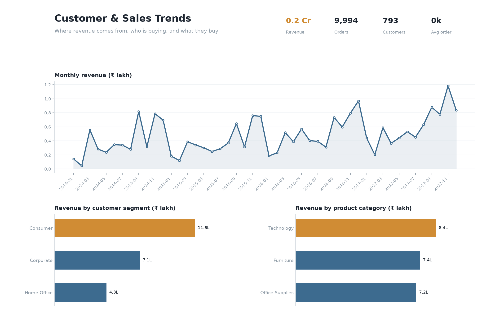
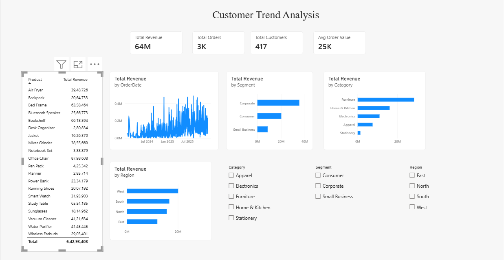

# Customer Trends & Sales Analysis

SQL analysis of customer and sales data, with a dashboard summarising the results.

**The question:** where is revenue coming from, who is buying, and what should the
business do differently?



### Power BI version

An interactive version built in Power BI Desktop, with slicers for region, segment and product category.



The .pbix file is in the repository root.

---

## The data

Two tables, which is how sales data is normally stored:

- **`customers.csv`** — 420 customers, with region, segment and signup date
- **`orders.csv`** — 2,600 orders, with date, product, category, quantity, price,
  discount and revenue

Because region and segment live on the customer while revenue lives on the order, most
of the analysis needs a **JOIN** between the two.

Covers January 2024 to December 2025. Total revenue ₹6.4 crore.

---

## What I found

**1. Corporate customers are 29% of the base but 55% of the revenue.**
123 corporate customers out of 420 generate ₹3.54 crore of the ₹6.43 crore total. Their
average order is ₹43,844 against ₹14,114 for consumers — roughly three times larger.
Consumers place more orders (1,432 vs 808) but each one is worth far less.

**2. Revenue grew steeply, then flattened.**
Monthly revenue climbed from about ₹4 lakh in early 2024 to ₹50 lakh by mid-2025, then
held roughly flat for the last six months. The growth came from the customer base
expanding, not from customers spending more — average order value stayed around
₹25,000 throughout. That matters: the growth engine has stalled and nothing has replaced it.

**3. Furniture is nearly half of all revenue.**
₹2.83 crore of ₹6.43 crore comes from one category, driven by high unit prices rather than
volume. Stationery sells comparable order counts but brings in ₹13.8 lakh — about 2% of
revenue. High order volume in a low-value category is a cost, not a win.

**4. Regional revenue differences are mostly about customer count, not customer quality.**
West leads on total revenue (₹2.01 crore), but revenue per customer is nearly identical
across West, South and East at around ₹1.59 lakh. North is the outlier at ₹1.40 lakh.
So the regions aren't performing differently — West simply has more customers.

**What I'd recommend:** average order value is flat while customer acquisition has slowed,
so the next gain has to come from existing customers. The corporate segment is where that's
worth trying, since those customers already spend three times more per order.

---

## How it works

Queries live in `/queries`, numbered in the order they build on each other.

| File | What it answers |
|---|---|
| `01_revenue_over_time.sql` | How revenue has moved month by month |
| `02_revenue_by_region.sql` | Which regions bring in the most, and per customer |
| `03_customer_segments.sql` | How the three customer types differ |
| `04_product_performance.sql` | Which products lead within their own category |
| `05_top_customers.sql` | Who the most valuable customers are |
| `06_category_by_segment.sql` | Whether different customer types buy different things |

### The SQL, in plain terms

- **`JOIN`** — combines the two tables on `CustomerID`, so customer details and order
  revenue can be looked at together. Used in most queries here.
- **`GROUP BY`** — collapses many rows into one summary row, e.g. one line per region.
- **CTE (the `WITH` block)** — a named temporary result you build first, then query. In
  `04_product_performance.sql` revenue per product is worked out first, then ranked.
- **Window functions** — a calculation across rows that keeps every row visible.
  `RANK() OVER (PARTITION BY Category ...)` ranks products **within** each category rather
  than against the whole catalogue, and `SUM(...) OVER (PARTITION BY Category)` gives each
  product's share of its own category on the same line.

---

## Running it

```bash
python generate_data.py     # creates data/customers.csv and data/orders.csv
python run_analysis.py      # loads into SQLite, runs every query, prints results
python build_dashboard.py   # writes output/dashboard.png
```

SQLite is used so there's nothing to install. The SQL is standard and runs in MySQL
Workbench too.

---

## Files

```
customer-trends-analysis/
├── README.md
├── generate_data.py
├── run_analysis.py
├── build_dashboard.py
├── data/
│   ├── customers.csv
│   └── orders.csv
├── queries/
│   ├── 01_revenue_over_time.sql
│   ├── 02_revenue_by_region.sql
│   ├── 03_customer_segments.sql
│   ├── 04_product_performance.sql
│   ├── 05_top_customers.sql
│   └── 06_category_by_segment.sql
└── output/
    └── dashboard.png
```

---

## A note on the data

The dataset is generated by `generate_data.py` rather than taken from a real company.
The generator builds in realistic behaviour — seasonal lifts around the festive period,
corporate customers ordering in larger quantities, category price differences — which the
analysis then recovers.
